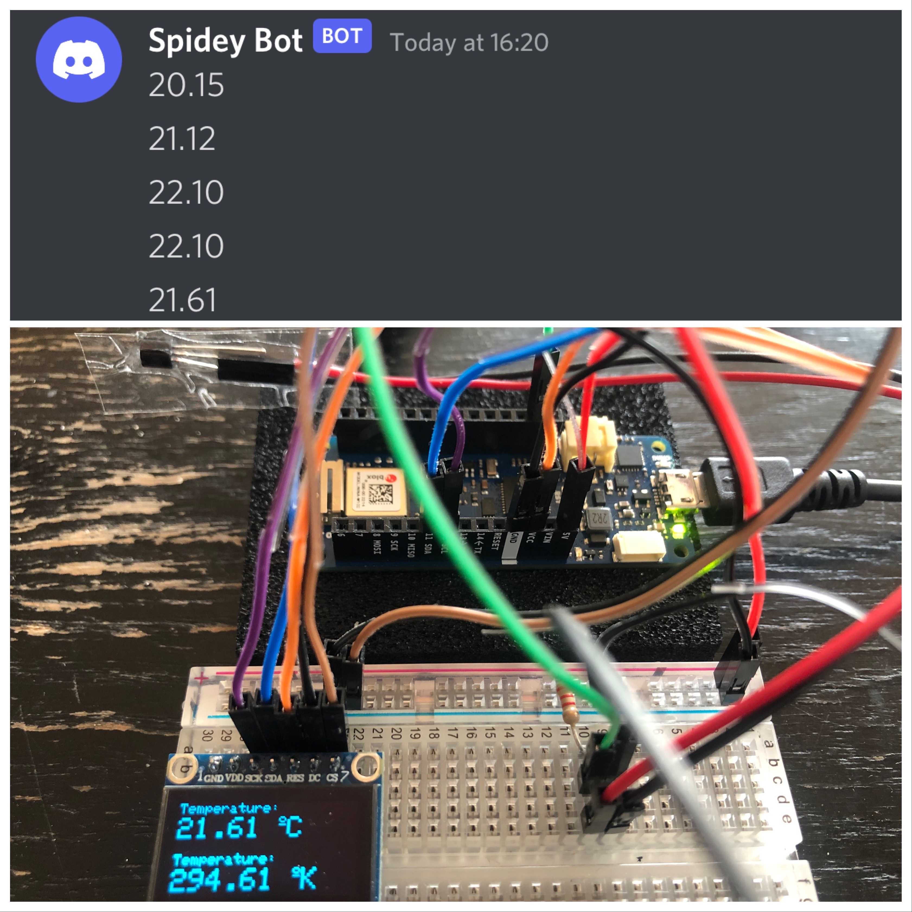
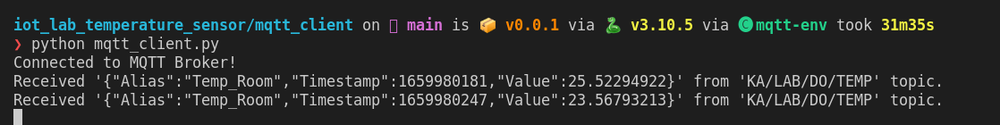
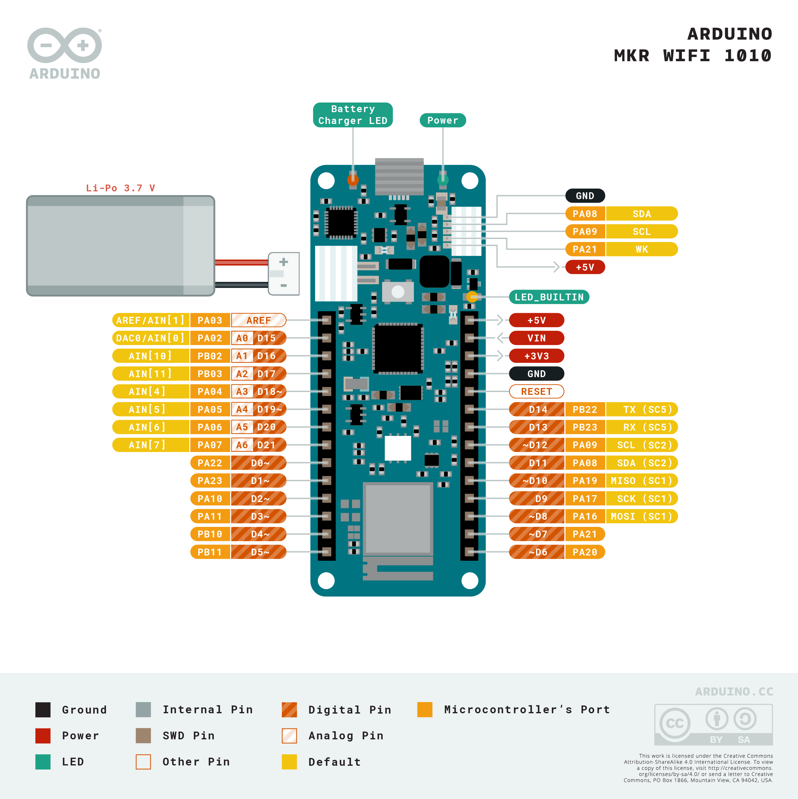

# Iot Lab Temperature Sensor

IOT sensor to monitor the cooling room temperature. Main aim is to:  
* Notify user on mobile when there is a high tempureature alert (send via webhook to Discord/MS TEAMS)
* Log the values (PI historian/datalake)

**Arduino MKR WIFI 1010 and LM335A Temperature Sensor**  
<p align="center">
  
</p>


## Parts List  

- [Arduino MKR WIFI 1010](https://www.computersalg.dk/i/4892362/arduino-mkr-wifi-1010-arm-cortex-m0-48-mhz-0-256-mb-32-kb-arduino-25-x-61-5-mm)  
- [LM335A - Precision Temperature Sensor](https://elektronik-lavpris.dk/p100429/lm335az-temp-sensor-40-100c-to92-05)  
- [OLED SPI Display SSD1306](https://elektronik-lavpris.dk/p143602/modu0052-ssd1306-128x64-pixel-uoled-display-module-blue/)
- 2.2K Resistor  

## Getting started with the hardware   

**Temperature sensor and oled**
- https://randomnerdtutorials.com/arduino-lm35-lm335-lm34-temperature-sensor/
- https://elektronik-lavpris.dk/files/sup2/LM135.pdf

**Connecting to AWS IoT**  
https://docs.arduino.cc/tutorials/mkr-wifi-1010/securely-connecting-an-arduino-mkr-wifi-1010-to-aws-iot-core 
<p align="center">
  
</p>

**Note:**   

1. Create a file called arduino_secrets.h in the temp_display_webhook folder with your credentials:  
```
#define SECRET_SSID "my_sid"  
#define SECRET_PASS "my_password"  
#define SECRET_WEBHOOK "https://discord.com/api/webhooks/xxx"  
#define SECRET_TTS "true"  
#define SECRET_WEBHOOK_MS "https://outlook.webhook.office.com/webhookb2/xxx"  
// Fill in the hostname of your AWS IoT broker
#define SECRET_BROKER "xxxxxxxxxxxxxx.iot.xx-xxxx-x.amazonaws.com"
// Fill in the boards public certificate
const char SECRET_CERTIFICATE[] = R"(
-----BEGIN CERTIFICATE-----
-----END CERTIFICATE-----
)";
```
2. SPI should be faster than I2C but I could not get it to work. Hence, the display was [converted to I2C](https://www.instructables.com/OLED-Tutorial-Convert-SPI-to-I2C/). For futer projects purchace the [I2C version of the OLED](https://elektronik-lavpris.dk/p148473/sbc-oled01-oled-display-for-arduino-raspberry-pi-or-other-single-board/)  

## Subscribing to a MQTT topic using python   
1. Clone this GIT repository:
```
git clone git@github.com:PriceTT/iot_lab_temperature_sensor.git
```
___

2. Set up an virtual environment.  

Navigate to **mqtt_client** folder and create conda evironment which reads the `environment.yml` file.
```
conda env create
```

Activate the virtual environment.
```
conda activate mqtt-env

```
Insall python packages
```
poetry install  
```
___
3. Subscribe to the broker  
```
python mqtt_client.py 

```
<p align="center">
  
</p>


## TODO  
- Test connecting to teams (blocked by getting the correct domain)
- Test connecting to aws mqtt topics with python
- Test on NZ network
- Test out PI integration
- Random dots on screen during load (puttin the vcc and in the reset seems to work)  
- ~Average temp over a period~
- ~Send data via MMQT~
- ~Add wifi and loading status on screen during load~
- ~Add time to the payload~


## Further Reading and Info
**MMQT**  
- https://docs.arduino.cc/tutorials/mkr-wifi-1010/mqtt-device-to-device
- https://juanstechblog.blogspot.com/2022/02/diy-mqtt-temperature-humidity-sensor-arduino-esp8266-dht22.html
- http://www.whatimade.today/make-a-remote-temp-sensor-with-permanent-display-inside-your-house/
- https://randomnerdtutorials.com/what-is-mqtt-and-how-it-works/
- https://randomnerdtutorials.com/esp32-mqtt-publish-subscribe-arduino-ide/
- https://randomnerdtutorials.com/esp8266-nodemcu-date-time-ntp-client-server-arduino/
- https://developers.wia.io/release/things/mkr-wifi-1010
- https://aws.amazon.com/blogs/compute/visualizing-sensor-data-in-amazon-quicksight/

**Rest API server**  
- https://www.survivingwithandroid.com/esp32-rest-api-esp32-api-server/
- https://www.arduino.cc/en/Guide/MKRWiFi1010/hosting-a-webserver

**Webhook**  
- https://create.arduino.cc/projecthub/usini/send-a-message-on-discord-f216e0
- https://stackoverflow.com/questions/55588751/how-to-post-to-a-ms-teams-webhook-from-esp8266
- https://forum.arduino.cc/t/wifi-end-disables-connection-but-not-the-wifi-module/604754/3
- https://docs.arduino.cc/tutorials/communication/wifi-nina-examples
- https://store-usa.arduino.cc/products/arduino-mkr-wifi-1010

**Send data to PI**  
- https://pisquare.osisoft.com/s/Blog-Detail/a8r1I000000H73GQAS/arduino-to-pi-with-pi-web-api
- https://pisquare.osisoft.com/s/Blog-Detail/a8r1I000000H73uQAC/pi-web-api-and-nodered
- https://pisquare.osisoft.com/s/Blog-Detail/a8r1I000000GvfiQAC/raspberry-pi-to-pi-with-pi-web-api-part-22
- https://pisquare.osisoft.com/s/Blog-Detail/a8r1I000000GvfYQAS/arduinoraspberry-pi-data-logger-part-12
- https://pisquare.osisoft.com/s/Blog-Detail/a8r1I000000GvrxQAC/internet-of-things-esp8266-writing-sensor-data-into-pi-via-the-webapi


**OLED Display**  
- https://randomnerdtutorials.com/guide-for-oled-display-with-arduino/ 
- https://electropeak.com/learn/interfacing-0-96-inch-spi-oled-display-module-with-arduino/
- https://www.instructables.com/OLED-Tutorial-Convert-SPI-to-I2C/
- https://lastminuteengineers.com/oled-display-arduino-tutorial/
- https://www.sarathiblog.com/SPI-oled-arduino.html
- https://www.engineersgarage.com/arduino-ssd1306-oled-display/
- https://circuitdigest.com/microcontroller-projects/arduino-ssd1306-oled-display
- https://www.electronics-lab.com/project/intelligent-power-switch-for-the-arduino/
- https://iotexpert.com/debugging-ssd1306-display-problems/

**Temperature Sensors**  
- https://create.arduino.cc/projecthub/sarful/serial-temperature-sensor-arduino-workshop-aab43a?ref=part&ref_id=8233&offset=149  
- https://forum.arduino.cc/t/lm135-precision-temperature-sensor/20085/4
- https://www.arnabkumardas.com/arduino-tutorial/lm335-temperature-sensor/
- https://diyodemag.com/education/the_classroom_the_lm335_temperature_sensor#tab-altronics-1167440571
- https://www.arduino.cc/en/Guide/MKRWiFi1010/connecting-sensors  
- https://forum.arduino.cc/t/averaging-of-data/545871/4

**Pinout Arduino MKR WIFI 1010**   
<p align="center">
  
</p>
